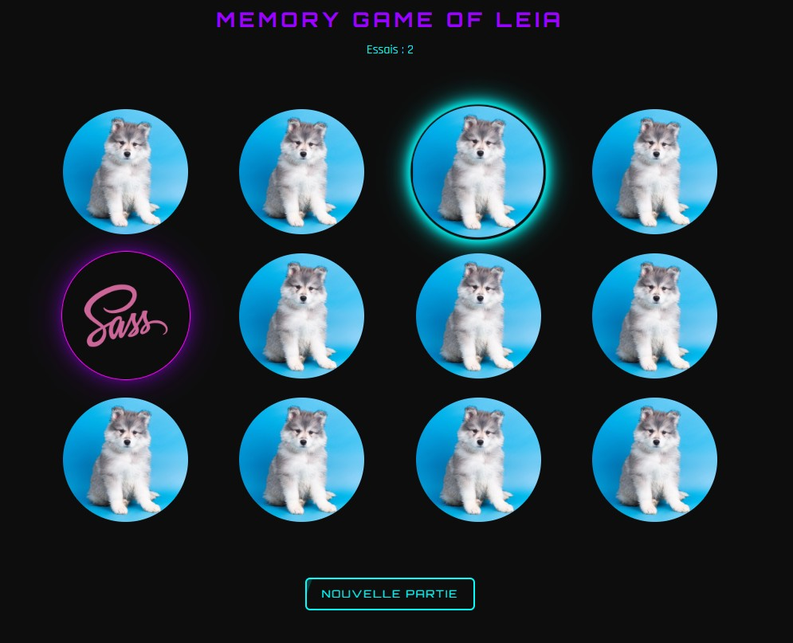

# 🎮 MEMORY GAME of Leia 🐺
Un jeu de memory au style cyberpunk 100% responsive développé en HTML, CSS et JavaScript Vanilla


## 📸 APERCU


## 🎯 OBJECTIF
J'ai développé ce projet pour améliorer ma compréhension de la manipulation du DOM, des événements JavaScript et du design responsive en mobile-first.

Dans un premier temps dans le cadre de ma formation en développement web, puis j'ai amélioré le projet pour alimenter mon portfolio.

## ⚙️ FONCTIONNALITES
- Interface responsive mobile-first
- Design neon inspiré de l'univers cyberoybk
- Effets d'animation néon (CSS only)
- Comptage du nombre d'essais
- Nouvelle partie en un clic

##  🛠️  TECHNOLOGIES UTILISEES
- HTML5
- CSS3 (modulaire et maintenable)
- JavaScript Vanilla (DOM, events, logique de jeu)

## 🧰 COMPETENCES MOBILISEES
- Conception mobile-first
- Manipulation du DOM en JavaScript pur
- Création d’animations CSS sans librairies
- Structuration modulaire du CSS (fichiers organisés)
- Responsive design sans framework

##  🌳 ARBORESCENCE DU PROJET

| Dossier/Fichier    | Description                               |
|--------------------|-------------------------------------------|
| 📁 img             | Contient les images des cartes            |
| 📁 public          | Contient les fichiers publics (screens, ...)  |
| 📂 styles                     |
| ├── animations.css | Styles pour les animations              |
| ├── base.css       | Styles de base (reset, polices, etc.)    |
| ├── cards.css      | Styles pour les cartes du jeu           |
| ├── layout.css     | Mise en page générale du plateau de jeu          |
| ├── main.css       | CSS central importé dans le html             |
| ├── responsive.css | Gestion du responsive           |
| └── variables.css  | Variables CSS (couleurs, fonts, etc.)  |
| 📄 index.html      | Fichier principal               |
| 📄 main.js         | Logique du jeu en JavaScript            |
| 📄 readme.md       | Ce fichier README                    |

##  🚀 INSTALLATION 
Clone le repo :
```bash 
git clone https://github.com/Beeweb042/memory-game.git
```
Ouvre simplement le fichier `index.html` dans ton navigateur, aucune installation n'est nécessaire !

Une fois le jeu lancé, **cliquez sur les cartes** pour les retourner et tenter de trouver les paires cachées. Le nombre d'essai est comptabilisé et vous pourrez relancer une nouvelle partie en cliquant sur le bouton !

## 🧠 PISTES D'AMELIORATION
- ⏳ Ajouter un **timer** pour pimenter la partie
- 🥇 Mettre en place un système de **meilleur score** (en `localstorage`)
- 🚥 Créer **plusieurs niveaux** de difficulté
- 🔔 Ajouter des **sons** pour les interactions (désactivable)
- 🎉 Intégrer une animation de **victoire**

## 🫱🏽‍🫲🏽 CONTRIBUER à mon projet
Les contributions sont les bienvenues 🤗!

Pour contribuer à ce projet, suivez ces étapes :
1. Forkez le dépôt
2. Créez une nouvelle branche (`git checkout -b ma-branche`).
3. Faites vos modifications
4. Effectuez un commit de vos changements (`git commit -am 'ce que vous avez fait'`)
5. Poussez sur votre branche (`git push origin ma-branche`)
6. Créez une pull request et voilà 😎


## 🙏 CREDITS
- Icône : [Flaticon](https://www.flaticon.com/)  
- Polices Orbitron & Rajdhani : [Google Fonts](https://fonts.google.com/)  
- Badges : [Shields.io](https://img.shields.io/)  


## 💻 DEVELOPPEUSE
**Barbara B.**  
Développeuse web & web mobile *junior*  
📍 ***Roche-la-Molière***  
💼 [LinkedIn](https://www.linkedin.com/in/barbara042) • 🌐 [Portfolio](https://github.com/Beeweb042) • 📫 [M'envoyer un mail](mailto:beeweb042@gmail.com)
